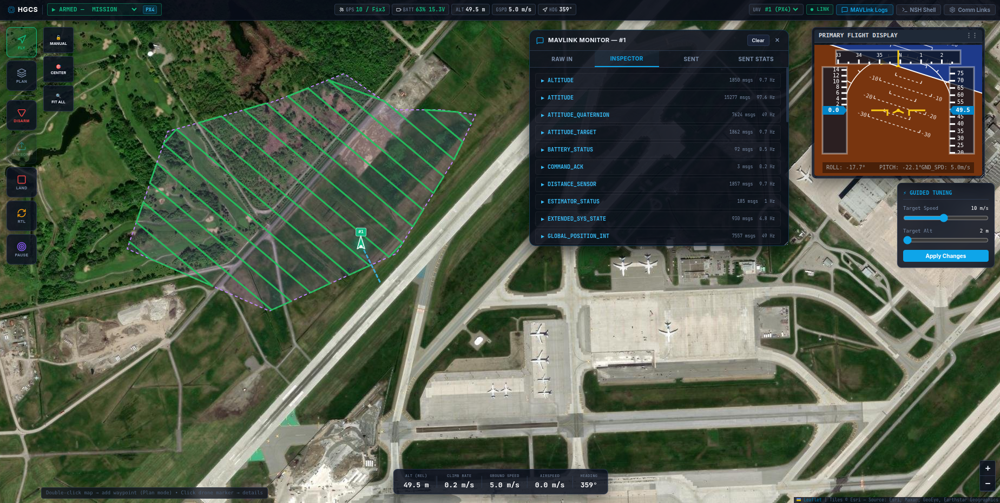

# HGCS (HTML Ground Control Station) 🚀
  

[繁體中文](#中文說明) | [English](#english-description)

---

## 中文說明

HGCS (HTML-based Ground Control Station) 是一個基於 Web 技術打造的輕量化地面控制系統，旨在平替 QGroundControl (QGC) 的核心狀態監控與任務編排功能。本專案採用**雙層解耦架構**：將物理通訊、協議解析、航點上傳狀態機完全隔離於後端代理層（Gateway），而前端網頁層（Web UI）則專注於即時渲染與地圖任務規劃。

> [!IMPORTANT]
> **本專案的核心開發原則為：極力推廣使用 LLM Agent 進行開發，避免使用人力編碼。**
>
> 本專案絕大部分的核心邏輯、修復、優化和文件，均由 AI Agent（Google Antigravity / Gemini）自動掃描專案現況、自主推理並直接寫入。人工僅扮演方向指引與最終驗證的角色。

### 🌟 核心特色

#### 1. 雙層解耦架構
- **HGCS Gateway（後端代理）**：以 Python 多執行緒引擎為核心，流式解析 MAVLink v1/v2 封包，轉譯為標準 JSON Telemetry 模型；在背景執行 MAVLink Mission Protocol 狀態機（Count → Request → Write → ACK），具備超時重傳與 ACK 驅動可靠上傳機制。
- **HGCS Web UI（前端網頁）**：基於 React + TypeScript + Vite，配合 HTML5 Canvas 實現高達 60fps 的 PFD 姿態儀，以及極其流暢的 Leaflet 互動地圖。

#### 2. QGC 沉浸式滿版排版
- 地圖作為 100% 全螢幕背景，所有控制板面皆為懸浮設計。
- 左側懸浮工具列整合一鍵 Arm / Takeoff / Land / RTL / Pause 操作，並配備滑動確認條防誤觸。
- 右側 Plan 面板可進行航點編輯、高度與停滯時間參數調整，並上傳 / 同步任務。

#### 3. 多飛控品牌相容（PX4 & ArduPilot）
- 自動偵測飛控類型（PX4 / ArduPilot），動態調整模式切換指令格式。
- PX4 模式正確解析 `custom_mode` 位元欄位（`main_mode` @ bit 16–23，`sub_mode` @ bit 24–31）。
- ArduPilot 直接對應模式整數值（AUTO=3、LOITER=5、RTL=6…）。
- 頂部狀態列顯示飛控品牌 Badge、模式下拉選單支援 10 種核心飛行模式切換。

#### 4. 可靠任務上傳狀態機
- ACK 驅動循環，同時監聽 `MISSION_REQUEST`、`MISSION_REQUEST_INT`、`MISSION_ACK`，杜絕因封包丟失或飛控 Flash 寫入延遲引發的上傳超時。
- 自動識別 PX4 飛控，不強行插入 `seq 0` Home 點，使 `TAKEOFF` 從 `seq 0` 開始，通過 PX4 可行性檢查器。
- 動態將任務中的 `RTL` 轉譯為 `LAND`（僅限 PX4），解決 `MAV_MISSION_UNSUPPORTED (Code 3)` 錯誤。

#### 5. 多機連線與多角色通訊中心
- 支援 **UDP / TCP / SERIAL** 三種協定，可配置 Server / Client 角色連線至 PX4 SITL 或實體硬體。
- 支援多機並連：同時追蹤多架飛機的遙測訊號，一鍵切換主控載具，地圖分別顯示各機軌跡。

#### 6. MAVLink Monitor（三分頁除錯視窗）
- **Raw Logs**：即時顯示所有收發的 MAVLink 封包文字，依當前主控載具自動篩選。
- **Inspector**：仿 QGC MAVLink Inspector，統計各類訊息的收訊次數、即時頻率（Hz）與最新欄位值，以滑動窗口（最近 5 筆）精準計算頻率，依當前主控載具隔離顯示，杜絕多機資料混用。
- **Sent Logs**：即時顯示由 GCS 發出的所有 MAVLink 指令（Arm、Set Mode、Takeoff 等），包含從 Gateway 底層 `send` 攔截器捕捉的真實封包，以及 Mock 模式下的模擬封包，依當前主控載具篩選。
- 所有分頁皆為懸浮可拖曳視窗，支援 CSS `resize` 自由縮放。

#### 7. MAVLink NSH 遙傳終端機
- 直接在網頁上與 PX4 NuttShell 互動（使用 `SERIAL_CONTROL` device=10 即 `SERIAL_CONTROL_DEV_SHELL`）。
- Mock 模式下提供模擬 NSH 回覆（`help`、`ver`、`status`、`free`）。
- 懸浮視窗可拖曳移動與自由縮放。

#### 8. 無人機飛行軌跡繪製
- 解鎖（Arm）時自動開始在地圖上繪製飛行路徑（亮藍色虛線），上鎖（Disarm）時停止，下次解鎖時自動清除舊軌跡。

#### 9. 離線 PWA 與地圖快取
- 實作 Service Worker 快取，完全斷網環境下也能順利啟動 HGCS。
- 支援 Leaflet OSM 本地離線快取，確保戶外飛測不中斷。

---

### 📂 目錄結構

```
HGCS/
├── gateway/
│   └── gateway.py          # 後端代理主程序
└── web-ui/
    └── src/
        ├── App.tsx          # 前端主控台（狀態管理、WS 通訊、UI 渲染）
        ├── index.css        # Vanilla CSS 設計系統（暗黑科技風格）
        ├── components/
        │   ├── PFD.tsx      # Canvas 60fps 姿態儀
        │   └── Map.tsx      # Leaflet 互動地圖
        └── utils/
            └── surveyGenerator.ts  # 割草機路徑規劃算法
```

---

### 🛠️ 環境配置與依賴安裝

系統需安裝 **Node.js (≥ 20)** 與 **Python (≥ 3.10)**。

#### 前端網頁層
```bash
cd web-ui
npm install
```

#### 後端代理層
```bash
pip3 install websockets pymavlink pyserial
```

---

### 🚀 啟動說明

#### 💡 快速 Mock 體驗（無需任何實體硬體）

```bash
# 1. 啟動後端（Mock 模式）
python3 gateway/gateway.py --mock

# 2. 系統自動開啟瀏覽器至 http://127.0.0.1:8082
#    網頁會自動與後端連線，並展示 2 架模擬無人機的即時遙測

# 3. 加上 --debug 可在終端機印出所有 MAVLink 收發封包
python3 gateway/gateway.py --mock --debug
```

進入 **Plan** 視圖，在衛星地圖上**雙擊**新增航點，點擊 **Upload to Drone** 上傳任務。回到 **Fly** 視圖，點擊 **Arm** 並滑動解鎖，再 **Takeoff** 起飛，無人機將開始平滑飛行。

完畢後關閉瀏覽器分頁，後端服務 5 秒後偵測到無連線即自動結束。

#### 🔌 連接真實載具 / PX4 SITL

```bash
# 1. 啟動 PX4 SITL（預設 UDP 14540）或連接 Pixhawk 硬體
# 2. 啟動 Gateway
python3 gateway/gateway.py

# 3. 在網頁右上角 Comm Links 面板新增連線
#    - UDP Server: Port 14540（對應 SITL）
#    - TCP Client: Host 127.0.0.1, Port 5760
```

---

### 📜 開源授權

本專案採用 **[GPLv3 (GNU General Public License v3)](LICENSE)** 許可證。任何基於此專案的修改與衍生產品都必須保持開源並釋出原始碼。詳情請參閱 [LICENSE](LICENSE)。

---

## English Description

HGCS (HTML-based Ground Control Station) is a lightweight web-based ground control system designed to fully replace the core functionalities of QGroundControl (QGC), including status monitoring and mission planning. It adopts a **decoupled two-layer architecture**: isolating physical communication, MAVLink protocol parsing, and mission state machines in the backend Gateway, while the frontend Web UI focuses on real-time rendering and map-based mission planning.

> [!IMPORTANT]
> **Core Principle: We strongly advocate for codebases developed entirely by LLM Agents (e.g., Google Antigravity / Gemini) to minimize manual human coding.**
>
> The vast majority of core logic, bug fixes, optimizations, and documentation in this repository have been autonomously implemented by AI Agents. Humans only provide direction and validation.

### 🌟 Core Features

#### 1. Decoupled Two-Layer Architecture
- **HGCS Gateway (Backend)**: A multi-threaded Python engine that streams and decodes MAVLink v1/v2 packets into standardized JSON telemetry. Runs the MAVLink Mission Protocol state machine (Count → Request → Write → ACK) in the background with ACK-driven reliable upload and retry mechanisms.
- **HGCS Web UI (Frontend)**: Built with React, TypeScript, and Vite. Features a 60fps Primary Flight Display (PFD) via HTML5 Canvas and a smooth Leaflet-based interactive map.

#### 2. QGC Immersive Fullscreen Layout
- The map fills 100% of the screen, with all panels floating as overlays.
- Left toolbar integrates Arm / Takeoff / Land / RTL / Pause with slide-to-confirm safety locks.
- Right Plan panel handles waypoint editing, altitude/hold-time parameters, and mission upload/sync.

#### 3. Multi-Autopilot Compatibility (PX4 & ArduPilot)
- Auto-detects autopilot type (PX4 / ArduPilot) and dynamically selects the correct mode command format.
- PX4: correctly decodes `custom_mode` bitfields (`main_mode` @ bits 16–23, `sub_mode` @ bits 24–31).
- ArduPilot: maps mode names directly to integer values (AUTO=3, LOITER=5, RTL=6…).
- Topbar shows an autopilot brand badge and a 10-mode flight mode dropdown selector.

#### 4. Reliable Mission Upload State Machine
- ACK-driven loop monitoring `MISSION_REQUEST`, `MISSION_REQUEST_INT`, and `MISSION_ACK` simultaneously, eliminating upload timeouts caused by packet loss or slow Flash writes.
- Detects PX4 autopilot and skips the forced `seq 0` Home waypoint injection, placing `TAKEOFF` at `seq 0` to satisfy the PX4 feasibility checker.
- Dynamically translates `RTL` to `LAND` in mission sequences for PX4, resolving `MAV_MISSION_UNSUPPORTED (Code 3)` errors.

#### 5. Multi-Vehicle & Multi-Protocol Communication Hub
- Supports **UDP / TCP / SERIAL** protocols with configurable Server/Client roles for PX4 SITL or real hardware.
- Simultaneously tracks telemetry from multiple vehicles, with a single-click vehicle switcher and per-vehicle trajectory rendering on the map.

#### 6. MAVLink Monitor (Three-Tab Debug Panel)
- **Raw Logs**: Real-time display of all received/sent MAVLink packet strings, filtered by the currently active vehicle.
- **Inspector**: Mirrors QGC's MAVLink Inspector; shows per-message-type packet count, live frequency (Hz), and latest field values. Uses a sliding-window (last 5 timestamps) for accurate rate calculation. **Per-vehicle isolated** — no data mixing between multiple drones.
- **Sent Logs**: Real-time display of all MAVLink commands sent by the GCS (Arm, Set Mode, Takeoff, etc.), captured from the Gateway's underlying `send` interceptor for real connections and `_mock_log_outgoing_msg` for mock mode. Filtered by active vehicle.
- All panels are floating, draggable, and CSS-resizable overlays.

#### 7. MAVLink NSH Terminal Console
- Interact directly with the PX4 NuttShell from your browser, using `SERIAL_CONTROL` with device ID `10` (`SERIAL_CONTROL_DEV_SHELL`).
- Mock mode provides simulated NSH responses (`help`, `ver`, `status`, `free`).
- Floating, draggable, resizable overlay.

#### 8. Flight Trajectory Drawing
- Automatically begins drawing the flight path (bright blue dashed line) on the map when armed; stops on disarm and clears on the next arm event.

#### 9. Offline PWA & Map Caching
- Service Worker caching enables HGCS to load in fully offline environments.
- Supports Leaflet OSM tile caching for remote field operations without internet connectivity.

---

### 📂 Directory Structure

```
HGCS/
├── gateway/
│   └── gateway.py          # Backend proxy main script
└── web-ui/
    └── src/
        ├── App.tsx          # Frontend main controller (state, WS comms, UI)
        ├── index.css        # Vanilla CSS design system (dark tech aesthetic)
        ├── components/
        │   ├── PFD.tsx      # Canvas 60fps attitude indicator
        │   └── Map.tsx      # Leaflet interactive map
        └── utils/
            └── surveyGenerator.ts  # Lawnmower survey path generator
```

---

### 🛠️ Setup & Prerequisites

Requires **Node.js (≥ 20)** and **Python (≥ 3.10)**.

#### Frontend Web UI
```bash
cd web-ui
npm install
```

#### Backend Gateway
```bash
pip3 install websockets pymavlink pyserial
```

---

### 🚀 Usage Guide

#### 💡 Quick Mock Experience (No hardware needed)

```bash
# 1. Start backend in mock mode
python3 gateway/gateway.py --mock

# 2. Browser opens automatically to http://127.0.0.1:8082
#    The page auto-connects and shows real-time telemetry for 2 simulated drones

# 3. Add --debug to print all MAVLink packets in the terminal
python3 gateway/gateway.py --mock --debug
```

Switch to the **Plan** view, **double-click** the map to add waypoints, then **Upload to Drone**. Go back to **Fly**, click **Arm** and slide to confirm, then **Takeoff** to launch. Close the browser tab when done — the gateway auto-shuts down after 5 seconds of inactivity.

#### 🔌 Connecting to a Real Vehicle or PX4 SITL

```bash
# 1. Start PX4 SITL (default UDP 14540) or connect Pixhawk hardware
# 2. Start the Gateway
python3 gateway/gateway.py

# 3. In the browser, open the Comm Links panel (top-right) and add:
#    - UDP Server: Port 14540 (for SITL)
#    - TCP Client: Host 127.0.0.1, Port 5760
```

---

### 📈 PX4 SITL / SIH Verification Process

1. Set `SYS_HITL` parameter to SIH mode and reboot the autopilot.
2. Start the gateway and connect to the autopilot link.
3. In the browser, verify the PFD attitude gauge responds smoothly to hardware movement at 60fps.
4. Upload a mission (Takeoff → Waypoints → Land), arm, and switch to Mission mode. Observe the drone trajectory on the map for closed-loop verification.

---

### 📜 License

This project is licensed under the **[GPLv3 (GNU General Public License v3)](LICENSE)**. Any modifications or derivative works must remain open-source and make their source code available under the same terms. See [LICENSE](LICENSE) for details.
