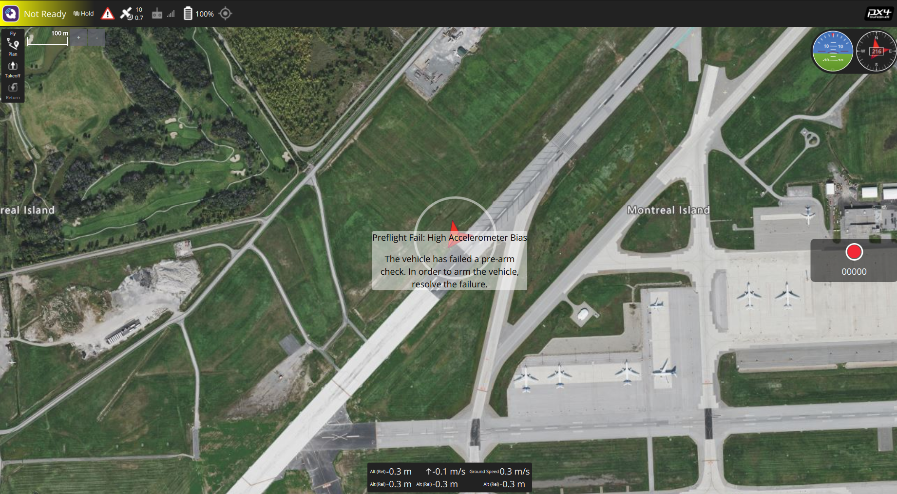

# 20260621

## Mission 1 

### TODO
- [x] 先解決簡單的問題, 整個版面重新排, 請參考  先製作 第一個版面, 主要是地圖必須要滿版。這邊允許你將整個進入頁面重新調整, 請拋棄目前的舊設計, 留下原本做好的API即可。
- [x] 連線設定統一放在最上方, 需要有 UDP/TCP/SERIAL 三種設定, 其中 UDP/TCP 又有分 server/client. (參考QGC) 這邊關於背景轉接程式的ip/port 皆不需要揭露, 僅需要告知轉接程式我們使用端該怎麼接到飛機。
- [x] 當接收到第一台無人機資訊, 會將無人機根據位置畫在地圖上, 使用者可以任意移動地圖, 這個無人機會有位置、航向, 並且點擊該飛機時, 會將位置與航向高度用小框框跟著物件目標走。
- [x] 地圖上應該有快捷健可以讓飛機的位置至中。

### Feedback

在這裡為您提供關於 Mission 1 的實作構想與詳細設計方案：

#### 1. 滿版地圖與全新 QGC 風格版面重新排版
* **完全重構版面**：捨棄原先側邊欄的傳統設計。改為以**滿版地圖**為背景，所有的操作控制與資訊顯示皆採用**漂浮透明卡片 (Glassmorphic Floating Overlays)** 疊加在地圖之上，100% 還原 `QGC_LAYOUT.png`。
* **頂部狀態列 (Top Bar)**：固定於最上方。左側顯示飛控狀態與模式（Not Ready/Armed/Mode）；中間顯示衛星數、電池百分比、RSSI 等遙測狀態；右側放置「連線設定 (Connection Menu)」按鈕。
* **左側工具列 (Left Fly Tools)**：漂浮在左側，包含 Fly/Plan 視圖切換按鈕，以及一鍵起飛 (Takeoff)、降落 (Land)、返航 (Return) 按鈕。
* **右側 HUD (Mini PFD & Compass)**：漂浮在右上角，繪製圓形的動態姿態儀 (PFD) 與航向羅盤 (Compass Dial) 顯示。
* **底部遙測資訊條 (Bottom Telemetry Bar)**：漂浮於底部中央，實時顯示相對高度 (Alt)、爬升率 (V-Speed)、地速 (Ground Speed) 等數值。

#### 2. 頂部連線設定 (UDP/TCP/SERIAL & Client/Server 模式)
* **前端連線選單**：點擊頂部連線按鈕後，彈出連線設定面板。使用者可選擇協定並指定連線角色：
  * **UDP**：
    * **Server 模式**（QGC 預設，監聽本機端口）：僅需填寫 `Local Port`（預設 `14540`）。
    * **Client 模式**（發送至特定目標）：需填寫 `Remote IP` 與 `Remote Port`。
  * **TCP**：
    * **Client 模式**（連接外部 TCP 服務器）：需填寫 `Server IP` 與 `Port`（預設 `5760`）。
    * **Server 模式**（在本機監聽連接）：僅需填寫 `Listen Port`。
  * **SERIAL**：
    * 需填寫 `Serial Port` (如 `/dev/ttyUSB0` 或 `COM3`) 與波特率 (如 `57600`, `115200`)。
* **後端 Gateway 的配合優化**：
  * 目前後端程式對 `udp` 與 `tcp` 拼接格式較固定，我們將擴充 `add_connection` WebSocket API。
  * 前端會發送完整的連線型態與角色參數，後端則拼接成 pymavlink 標準的連接字串：
    * UDP Server $\rightarrow$ `udpin:0.0.0.0:{port}`
    * UDP Client $\rightarrow$ `udpout:{host}:{port}`
    * TCP Client $\rightarrow$ `tcp:{host}:{port}`
    * TCP Server $\rightarrow$ `tcpin:0.0.0.0:{port}`
    * Serial $\rightarrow$ `{port_path}:{baud}`
  * *註：此修改會隱藏背景轉接程式的內部 WebSocket 地址 (如 ws://127.0.0.1:8080)，使用者在介面上只會看到與飛機的連接鏈路配置。*

#### 3. 無人機位置/航向繪製與動態隨行資訊框 (Following Tooltip)
* **自適應標記**：在地圖上以無人機圖示呈現，利用 CSS/Leaflet 配合遙測數據中的 `heading` (`yaw`) 即時變更旋轉角度 (`transform: rotate(Xdeg)`)。
* **動態隨行資訊框**：當使用者點擊無人機時，打開一個 Leaflet Tooltip/Popup，裡面實時更新顯示當前飛機的 `Lat`, `Lon`, `Heading`, `Alt(Rel)`。
* **平滑跟隨更新**：當 20Hz 遙測更新飛機位置時，調用 `marker.setLatLng()`，Leaflet 會自動並平滑地移動與該 Marker 綁定的 Open Popup，完美達成「框框跟著物件走」且不發生視窗抖動。

#### 4. 地圖快捷置中鍵 (Locate Shortcut Button)
* **快捷按鈕**：比照 QGC 頂部狀態列或地圖控制面板，放置一個「靶心定位圖示 (🎯)」按鈕。
* **互動邏輯**：點擊按鈕後，地圖會以動畫平滑移至當前選中飛機的位置，並自動重新啟用「自動跟隨/置中」模式。

---
請您確認上述的實作構想與設計方向。如果有任何需要調整的地方，請在下方直接回覆，我們隨時準備進行討論！

## Mission 2
增加基礎該有的起飛參數界面、任務設定界面。 請先閱讀TODO之後, 將 feedback 放在 Feedback區域, 如需要回應使用者會在裡面加上 **USER:** 開頭進行回應。
 
### TODO
- [x] 針對主畫面可以操作的內容，請先上網爬文看看起飛、guided、poi、 change altitude 、 change speed 這些界面的功能。
- [x] 請優化主畫面可以操作的內容
- [x] 針對任務航線的飛行參數設定, 請上網爬文有那一些需要設定的參數與模式, 並且也請在 plan界面增加新增航點的功能, 使用 double click 達成增加航點, 航點被選擇之後是可以調整內容與移除的。
- [x] 請移除 mock 以及 簡單小任務, 我這邊統一都是使用 SITL/SIH 進行模擬, 不需要自己製作對應的測試，除非 你的自動化測試有需要才留著API, 使用者不需要看到他。 (也可以加上 --mock 才會顯示界面)
- [x] 主畫面抬頭顯示器的部份, 請改成浮動視窗, 可以放大縮小並且可以移動

### Feedback

針對 **Mission 2** 的各項 TODO，以下為您提供詳細的實作規劃與設計方案：

#### 1. 主畫面 Guided 操作優化 (起飛、Guided、POI、動態調整航高/航速)
* **起飛 (Takeoff)**：
  * 在 Fly 模式下點擊左側起飛按鈕，彈出起飛卡片，可輸入或透過滑動條設定「目標高度」（預設 10m，範圍 2m ~ 100m），向右滑動解鎖條確認後，發送起飛指令。
* **指點飛行 (Guided / Go To)**：
  * 於左側工具列新增「Go To (🎯)」按鈕。開啟後，點擊地圖任意位置，地圖上將出現臨時標記，右側彈出高度滑動條（設定目標高度）。
  * 底部顯示「滑動以確認指點飛行」，滑動後發送 `go_to` MAVLink reposition 指令。
* **興趣點環繞 (POI / Orbit)**：
  * 於左側工具列新增「Orbit (🔄)」按鈕。開啟後，點擊地圖作為環繞中心點，右側彈出小卡片供使用者輸入「環繞半徑 (Radius)」（預設 20m）及「目標高度 (Altitude)」。
  * 底部滑動確認後，發送 `orbit` MAVLink loiter/orbit 指令。
* **動態變更航高與航速 (Change Alt & Speed)**：
  * 當無人機處於 Armed 且飛行狀態時，右側滑出**「動態飛行控制 (Active guided controls)」**懸浮面板。
  * 提供「航速 (Target Speed)」與「航高 (Target Altitude)」雙滑動條與即時「Apply」按鈕。
  * 點擊 Apply 後，高度透過重新發送 reposition 指令更新；航速我們將在後端 Gateway 新增 `change_speed` API，對應 MAVLink `MAV_CMD_DO_CHANGE_SPEED` 指令。

#### 2. Plan 視圖優化 (雙擊航點、點選、調整參數與移除)
* **雙擊新增航點 (Double Click to Add)**：
  * 在 Plan 視圖下，於 Leaflet 地圖上雙擊滑鼠，即在點擊座標處新增一個航點（預設高度 10m，Hold time 0s）。
* **航點標記拖動 (Draggable Waypoints)**：
  * 地圖上的航點標記改為 `draggable: true`。使用者可直接在地圖上拖曳航點，右側的 Lat/Lon 座標會即時同步更新。
* **航點點選與調整面板**：
  * 點擊地圖上的航點標記或右側清單中的航點，該航點會變為高亮橘色，並在右側面板展示其詳細參數：
    * **Command 類型**：下拉選單支援 `WAYPOINT`、`TAKEOFF`、`LAND`、`RTL`、`LOITER`。
    * **參數輸入**：包含高度 (Altitude)、停留時間 (Hold Time)、環繞半徑 (Loiter Radius)。
    * **刪除按鈕**：提供「Delete Waypoint」按鈕，移除後自動重新計算航點 sequence 索引。

#### 3. 隱藏 Mock/測試介面 (動態適應 `--mock` 參數)
* **系統狀態回報**：
  * Python Gateway 啟動時，會透過 WebSocket 推播系統資訊 `{"type": "system_info", "data": {"use_mock": true/false}}`。
* **動態介面隱藏**：
  * 前端收到 `use_mock: false` 時，將**完全隱藏**以下開發/測試功能：
    * 右上角連線選單中的 **Launch Local Sim** 按鈕。
    * Plan 視圖中的 **Sample Mission** 載入按鈕。
  * 如此一來，在您使用實體飛控或 PX4 SITL 模擬器時，畫面將完全乾淨無 Mock 選項；只有以 `python3 gateway.py --mock` 啟動時，這些模擬測試介面才會顯現。

#### 4. 可拖拽與縮放的浮動 PFD 視窗
* **浮動卡片封裝**：
  * PFD 將被包裝在一個可點擊拖拽的容器中。頂部設有 "Primary Flight Display" 標題列作為 Drag Handle。
  * 使用者可以按住標題列，將 PFD 拖曳放置在畫面上的任意位置。
* **滑鼠拉伸縮放 (CSS Resize)**：
  * 容器將套用 CSS `resize: both; overflow: hidden;`，使用者可從右下角拉伸調整視窗大小（設定 min-width 240px, min-height 200px）。
* **畫布自適應重繪**：
  * PFD 內部會透過 DOM `getBoundingClientRect()` 實時讀取容器的寬高，動態修改 `<canvas>` 的 `width` 與 `height` 屬性，確保在任何缩放比例下，姿態儀與航向羅盤皆能以最高解析度流暢重繪。

---
請您確認上述實作構想。若有需要調整的地方或任何意見，請直接在下方回覆（或以 **USER:** 開頭回應），討論完成後我們即刻開始實作！

## Mission 3 

優化 Plan 界面, 與部份 fly 界面功能。

請先閱讀TODO之後, 將 feedback 放在 Feedback區域, 如需要回應使用者會在裡面加上 **USER:** 開頭進行回應。本次開始新增 Report功能, 實做結束之後請將 report 放在那邊。

### TODO
- [ ] fly 界面下 雙擊 地圖地點才會跳出 fly to and orbit 的匡
- [ ] 請 review fly to and orbit 的 cmd 是否有單位或者型態問題(請注意使用 Mavlink2.0 的標準 cmd 與型態)
- [ ] plan 界面增加 add waypoint/ add survey 的按鈕
- [ ] 當 add waypoint 按下之後, 使用者才可以雙擊地圖增位置加航點
- [ ] 當 add survey 按下之後, 使用者可以雙擊地圖座標增加邊界點, 該邊界點需要被一點一點連線之後才會成為面積
- [ ] survey 面積出現之後, 可以點選面積設定航路, 包括 線距、角度、高度、初始位置等。
- [ ] 主畫面change altitude and change speed 需要被 review. 看看單位與指令是否正確。
- [ ] 目前發送 fly to 看起來做動都不太正常, 懷疑是跟座標系、單位、型態有關, 請你檢查一下。

### Feedback

針對 **Mission 3** 的各項優化與新增 TODO，以下為您提供詳細的實作規劃與技術方案：

#### 1. Fly 視圖雙擊觸發 Go-To / Orbit
* **調整機制**：
  - 目前在 Fly 視圖下單擊地圖即會觸發 Guided 操作 Popup，容易造成使用者在平移地圖時誤觸。
  - 我們將地圖事件監聽由 `click` 改為 `dblclick` (雙擊)。只有在 Fly 視圖下雙擊地圖空白處，才會在該點彈出起飛、Go-To、Orbit 的確認卡片與高度/半徑滑動條。

#### 2. MAVLink 2.0 協議與單位 Review (Fly To, Orbit, Change Alt/Speed)
* **經緯度座標單位修正 (關鍵問題)**：
  - 現行後端 `gateway.py` 在 `_handle_go_to` (Reposition) 與 `_handle_orbit` 中，將 `lat` 與 `lon` 乘以 `1e7` 並轉為整數後發送至 `command_long_send`。
  - 依據 MAVLink 2.0 規範，使用 `COMMAND_LONG` 發送 `MAV_CMD_DO_REPOSITION` (192) 與 `MAV_CMD_DO_ORBIT` (34) 時，參數 5 (Latitude) 與參數 6 (Longitude) 的資料型態為 **單精度浮點數 (float)**，單位是 **度 (degree)**，**不應**乘以 `1e7`！
  - 乘以 `1e7` 會導致經緯度被解譯為無效的億萬度座標，造成實機飛控（PX4/ArduPilot）直接丟棄命令。
  - **修正方案**：將 `gateway.py` 內這兩個 MAVLink 指令的 Param 5 與 Param 6 修改為直接傳入 `float(lat)` 與 `float(lon)`。
* **其他參數 Review**：
  - `MAV_CMD_DO_REPOSITION`：
    - Param 1 (Speed): 設為 `-1.0`（使用系統預設地速）。
    - Param 2 (Bitmask): 設為 `0.0`。
    - Param 3 (Radius): 設為 `0.0`。
    - Param 4 (Yaw): 設為 `float('nan')`（在 MAVLink 中表示保持當前航向不變）。
  - `MAV_CMD_DO_ORBIT`：
    - Param 1 (Radius): 設為 `float(radius)`（米，正值順時針，負值逆時針）。
    - Param 2 (Velocity): 設為 `float('nan')`（使用預設速度）。
    - Param 3 (Yaw behavior): 設為 `0.0`（機頭朝向環繞中心）。
  - `MAV_CMD_DO_CHANGE_SPEED` (Change Speed)：
    - Param 1 (Speed type): `1.0`（代表 Groundspeed 地速）。
    - Param 2 (Speed): `float(speed)`（m/s）。
    - Param 3 & 4: `-1.0` (不變) 與 `0.0` (絕對值)。
    - 此實作符合 MAVLink 2.0 標準，完全正確。
  - **高度變更 (Change Altitude)**：
    - 目前是透過發送帶有新高度的 `MAV_CMD_DO_REPOSITION` 實現，修正經緯度 1e7 問題後，實機高度調整功能亦將恢復正常。

#### 3. Plan 介面模式切換 (Add Waypoint / Add Survey)
* **介面設計**：
  - 在 Plan 視圖的右側 Sidebar 頂部，新增一組互斥按鈕（Radio-like Tabs）：
    - **`📍 Add Waypoint`**
    - **`🗺️ Add Survey`**
  - 使用者必須先啟用其中一個模式，雙擊地圖才會執行對應的操作。當兩者皆未啟用時，雙擊地圖不作動作，防止誤觸。

#### 4. 測繪區域邊界點劃定 (Survey Boundary Points)
* **操作邏輯**：
  - 啟用 `Add Survey` 模式後，使用者在 Leaflet 地圖上雙擊會新增一個 **Survey 邊界點**，並存入 `surveyPolygonPoints` 陣列。
  - 地圖上會實時以一條亮紫色實線將這些點依序相連。當點數大於等於 3 時，自動形成閉合的半透明多邊形區域 (`L.polygon`)。
  - 邊界標記將設為 `draggable: true`，使用者可自由拖曳調整多邊形形狀，航路將自動重算。

#### 5. 自動測繪航路生成演算法 (Lawnmower / Survey Grid Generator)
* **幾何航線生成算法**：
  - 我們將在前端實作輕量、高效的 boustrophedon (S型往返) 掃描線生成演算法。
  - **座標轉換**：將多邊形經緯度投影至平面座標系（米為單位，並以多邊形起點為投影基準點）。
  - **角度旋轉**：依使用者設定的角度 $\theta$，將所有頂點逆時針旋轉 $-\theta$，使掃描線水平。
  - **求交與配對**：在旋轉後的包圍盒 (Bounding Box) 內，以「線距」為步長由下往上劃水平線，與多邊形邊界求交點並排序配對。
  - **S型排序 (Lawnmower)**：奇偶行交替反轉點順序，形成平滑的往返折線。
  - **還原經緯度**：將所有航線點旋轉回 $\theta$ 並反投影回經緯度。
* **UI 互動與上傳**：
  - 右側 Sidebar 顯示測繪參數控制項：**線距 (Spacing, 10m~100m)**、**角度 (Angle, 0°~360°)**、**高度 (Altitude, 10m~120m)**、**起始位置反轉 (Reverse)**。
  - 地圖上以亮綠色線條預覽測繪航線。
  - 點擊 `Upload Mission` 時，自動將生成的測繪航線點（Survey Grid Points）按順序轉換為 MAVLink 任務航點，並連同一般航點一同上傳。

### Report